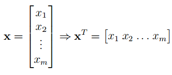
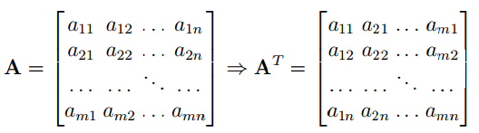
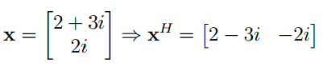
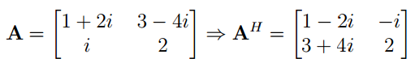
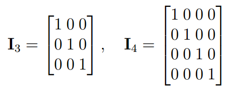
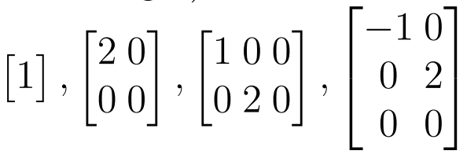
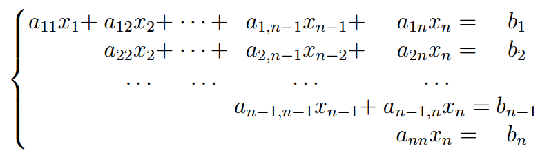
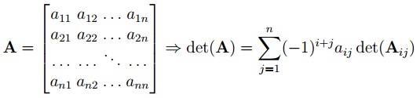
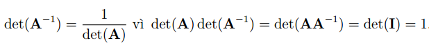
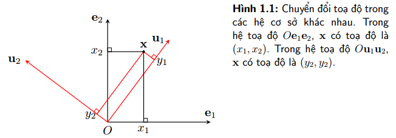

# 1. Lưu ý về kí hiệu
* Số vô hướng - chữ cái in nghiêng: $\mathit{x_1, N, y, k}$.
* Vector - chữ thường in đậm: $\mathbf{y, x_1}$.
  * **Vector hàng**: $\mathbf{x} = [x_1, x_2,...,x_n]$.
  * **Vector cột**: $\mathbf{x} = [x_1;x_2;...;x_n]$.
  * **LƯU Ý**: Nếu không nói gì thêm, các vector dc mặc định là **vector cột**.
* Ma trận - chữ hoa in đậm: $\mathbf{X, Y, W}$.
  * Ma trận được tạo thành từ các **vector cột** theo thứ tự **trái qua phải**: $\mathbf{X = [x_1, x_2,...,x_n]}$.
  * Ma trận được tạo thành từ các **vector hàng** theo thứ tự **trên xuống dưới**: $\mathbf{X = [x_1;x_2;...;x_n]}$.
  * Phần tử nằm ở dòng $i$ cột $j$ của ma trận kí hiệu là $x_{ij}$.
  * **LƯU Ý**: Cho ma trận $\mathbf{W}$, nếu không nói gì thêm thì $\mathbf{w_i}$ được hiểu là **vector cột** thứ $i$ của ma trận $\mathbf{W}$.

# 2. Chuyển vị và Hermitian
* Tên tiếng anh là **transpose**, kí hiệu là $T$.
* Cho $\mathbf{A} \in \mathbb{R}^{m \times n}$, ta nói $\mathbf{B} \in \mathbb{R}^{n \times m}$ là chuyển vị của $\mathbf{A}$ nếu:
  $$b_{ij} = a_{ji}, \forall1 \leq i \leq n, 1 \leq j \leq m$$
* Ví dụ:
  * Chuyển vị của vector $\mathbf{x}$ kí hiệu là $\mathbf{x}^T$.
    
  * Chuyển vị của ma trận $\mathbf{A}$ kí hiệu là $\mathbf{A}^T$.
    

* Ta có $\mathbf{A} \in \mathbb{R}^{m \times n}$ thì $\mathbf{A}^T \in \mathbb{R}^{n \times m}$. Nếu $\mathbf{A = A}^T$ thì $\mathbf{A}$ là **ma trận đối xứng** _(symmetric matrix)_.

* Trong trường hợp vector hay ma trận có phần tử là **số phức**, thì việc lấy chuyển vị sẽ kèm theo **lấy liên hợp phức** của phần tử đó. Quá trình này được gọi ngắn gọn là **chuyển vị liên hợp** _(conjugate transpose)_, kí hiệu là $H$.
* Chuyển vị liên hợp của ma trận $\mathbf{A}$ là $\mathbf{A}^H$ _(còn được gọi là_ $\mathbf{A}$ Hermitian _)_.
* Cho $\mathbf{A} \in \mathbb{C}^{m \times n}$, ta nói $\mathbf{B} \in \mathbb{C}^{n \times m}$ là chuyển vị liên hợp của $\mathbf{A}$ nếu:
  $$b_{ij} = \overline{a_{ji}}, \forall 1 \leq i \leq n, 1 \leq j \leq m$$
  với $\overline{a}$ là liên hợp phức của $a$.

* Ví dụ:
  * Chuyển vị liên hợp của vector $\mathbf{x}$ kí hiệu là $\mathbf{x}^H$.
    
  * Chuyển vị liên hợp của ma trận $\mathbf{A}$ kí hiệu là $\mathbf{A}^H$.
    

* Nếu $\mathbf{A, x}$ lần lượt là các ma trận thực và vector thực thì:
  $$\mathbf{A}^H = \mathbf{A}^T, \mathbf{x}^H = \mathbf{x}^T$$

* Nếu chuyển vị liên hợp của một ma trận phức bằng với chính nó, $\mathbf{A}^H = \mathbf{A}$ thì nói gọi ma trận đó là **Hermittian**.

# 3. Phép nhân hai ma trận
* Cho hai ma trận $\mathbf{A} \in \mathbb{R}^{m \times n}, \mathbf{B} \in \mathbb{R}^{n \times p}$, thì tích của hai ma trận này kí hiệu là $\mathbf{C=AB} \in \mathbb{R}^{m \times p}$, khi đó phần tử tại dòng $i$ cột $j$ của ma trận kết quả được tính bởi:
  $$c_{ij} = \sum_{k=1}^{n}a_{ik} \times b_{kj}, \forall 1 \leq i \leq m, 1 \leq j \leq p$$

* Tính chất:
  * Không có tính chất giao hoán.
    $$\mathbf{AB} \neq \mathbf{BA}$$
  * Có tính chất kết hợp:
    $$\mathbf{ABC = (AB)C = A(BC)}$$
  * Có tính phân phối đối với phép cộng:
    $$\mathbf{A(B + C) = AB + AC}$$
  * Chuyển vị của một rích bằng tích các chuyển vị theo thứ tự **ngược lại**:
    $$\mathbf{(AB)^T}=\mathbf{B}^T \mathbf{A}^T, \mathbf{(AB)^H}=\mathbf{B}^H \mathbf{A}^H$$

* Bằng cách coi vector là một trượng hợp đặc biệt của ma trận, ta có tích vô hướng của hai vector _(inner product)_ $\mathbf{x, y} \in \mathbb{R}^n$ được định nghĩa là:
  $$\mathbf{x}^T \mathbf{y} = \mathbf{y}^T \mathbf{x} = \sum_{i=1}^{n} x_i \times y_i$$

* **LƯU Ý**: 
  $$\mathbf{x}^H \mathbf{y} = \mathbf{y}^H \mathbf{x} = (\mathbf{y}^H \mathbf{x})^H$$
  khi và chỉ khi chúng là các số thực.

  $$\mathbf{x}^H\mathbf{x} \geq 0, \forall \mathbf{x} \in \mathbb{C}^n$$

* Nếu tích vô hướng của **hai vector khác không** bằng không, thì hai vector đó **vuông góc với nhau**.

* Phép nhân của một ma trận $\mathbf{A} \in \mathbb{R}^{m \times n}$ với một vector $\mathbf{x} \in \mathbb{R}^n$ là một vector $\mathbf{b} \in \mathbb{R}^m$:
  $$\mathbf{Ax = b}, \text{với } b_i = \mathbf{A}_{:,i} \mathbf{x}$$
  với $\mathbf{A}_{:,i}$ là vector hàng thứ $i$ của ma trận $\mathbf{A}$.

* Ngoài ra còn có một phép nhân khác gọi là **Hadamard** _(còn được gọi là Element-wise)_ hay được sử dụng trong Machine Learning. Tích Hadamard của hai ma trận có **cùng kích thước** $\mathbf{A, B} \in \mathbb{R}^{m \times n}$ được định nghĩa là:
  $$\mathbf{C = A \odot B} \in \mathbb{R}^{m \times n}, \text{với } c_{ij} = a_{ij} \times b_{ij}$$

# 4. Ma trận đơn vị và ma trận nghịch đảo
## 4.1. Ma trận đơn vị
* **Đường chéo chính** của một ma trận là tập hợp các phần tử có chỉ số hàng và chỉ số cột như nhau. Các định nghĩa này cũng áp dụng trên các ma trận không vuông.

* Nếu ma trận $\mathbf{A} \in \mathbb{R}^{m \times n}$ thì đường chéo chính của $\mathbf{A}$ gồm các phần tử:
  $$\{a_{11}, a_{22},...,a_{pp} \}, \text{với } p = min\{m, n\}$$

* Một ma trận đơn vị bậc $n$ là một ma trận trận thuộc $\mathbb{R}^{n \times n}$ với các phần tử nằm trên đường chéo chính bằng $1$, các phần tử còn lại bằng $0$ và ma trận này được kí hiệu là $\mathbf{I}$ _(identity matrix)_.

* Ma trận đơn vị bậc $n$ được kí hiệu là $\mathbf{I}_n$. Ví dụ:
  

* Giả sử có $\mathbf{A} \in \mathbb{R}^{m \times n}, \mathbf{B} \in \mathbb{R}^{n \times m}$ và $\mathbf{I}_n$ thì:
  $$\mathbf{AI = A, IB = B}$$

* Với mọi vector $\mathbf{x} \in \mathbb{R}^n$ thì:
  $$\mathbf{I}_n \mathbf{x = x}$$

## 4.2. Ma trận nghịch đảo
* Một **ma trận vuông** $\mathbf{A} \in \mathbb{R}^{n \times n}$, nếu **tồn tại một ma trận vuông** $\mathbf{B} \in \mathbb{R}^{n \times n}$ sao cho:
  $$\mathbf{AB = I}$$
  * Thì $\mathbf{B}$ được gọi là **ma trận nghịch đảo** _(inverse matrix)_ của $\mathbf{A}$ và lúc này $\mathbf{A}$ được gọi là **khả nghịch** _(invertible, nonsingular, nondegenerate)_.
  * Nếu không tồn tại ma trận $\mathbf{B}$ thỏa điều kiện trên thì ta nói ma trận $\mathbf{A}$ **không khả nghịch** _(singular, degenerate)_.

* Nếu $\mathbf{A}$ khả nghịch thì ma trận nghịch đảo của $\mathbf{A}$ kí hiệu là $\mathbf{A^{-1}}$.
* Ma trận nghịch đảo được sử dụng để giải hệ phương trình tuyến tính. Giả sử $\mathbf{A} \in \mathbb{R}^{n \times n}$ là một ma trận khả nghịch và một vector $\mathbf{b} \in \mathbb{R}^n$ bất kì. Khi đó, phương trình:
  $$\mathbf{Ax = b}$$
  có nghiệm duy nhất $\mathbf{x = A^{-1}b }$.

* Giả sử hai ma trận $\mathbf{A, B}$ là hai ma trận khả nghịch thì **tích của chúng cũng khả nghịch** và:
  $$\mathbf{(AB)^{-1} = B^{-1}A^{-1}}$$

# 5. Một vài ma trận đặc biệt khác
## 5.1. Ma trận đường chéo
* **Ma trận đường chéo** _(diagonal matrix)_ là ma trận chỉ có các thành phần trên đường chéo chính **khác không**. Định nghĩa này cũng áp dụng cho các ma trận ko vuông.
* **Ma trận không** là ma trận có tất cả các phần tử trong ma trận bằng không.
* Ma trận không và ma trận đơn vi cũng được gọi là các ma trận đường chéo.
* Một vài ví dụ về ma trận đường chéo:
  

* Với các **ma trận đường chéo vuông**, thay vì viết cả ma trận, ta có thể chỉ liệt kê các thành phần nằm trên đường chéo chính. Ví dụ một ma trận đường chéo vuông $\mathbf{A} \in \mathbb{R}^{m \times m}$ có thể dc kí hiệu là:
  $$diag(a_{11}, a_{22},...,a_{nn})$$
  với $a_{ii}$ là phần tử nằm ở dòng $i$ cột $i$ của ma trận $\mathbf{A}$.

* Tích, tổng của hai ma trận đường chéo vuông **cùng bậc** cũng là một ma trận đường chéo vuông.
* Một ma trận đường chéo vuông khả nghịch nếu mọi phần từ nằm trên đường chéo chính khác không.
* Nghịch đảo của một ma trận đường chéo vuông khả nghịch cũng là một ma trận đường chéo, cụ thể:
  $$(diag(a_1, a_2,...,a_n))^{-1} = diag(a_1^{-1}, a_2^{-1},...,a_n^{-1})$$

## 5.2. Ma trận tam giác
* Một ma trận vuông dc gọi là **ma trận tam giác trên** _(upper triangular matrix)_ nếu tất cả các thành phần nằm dưới đường chéo chính bằng không.
* Một ma trận vuông dc gọi là **ma trận tam giác dưới** _(lower triangular matrix)_ nếu tất cả các thành phần nằm trên đường chéo chính bằng không.
* Xét hệ:
  
  * Hệ này có thể dc viết gọn dưới dạng $\mathbf{Ax = b}$ với $\mathbf{A}$ là ma trận tam giác trên.
  * Hệ phương trình này có thể được giải mà không cần tìm ma trận nghịch đảo $\mathbf{A^{-1}}$.
  * Nếu ma trận $\mathbf{A}$ là ma trận tam giác trên thì có thể áp dụng phương pháp **back substituation**.
  * Nếu ma trận $\mathbf{A}$ là ma trận tam giác dưới thì có thể áp dụng phương pháp **forward substituation**.

# 6. Định thức
## 6.1. Định nghĩa
* Định thức của một ma trận $\mathbf{A}$ được kí hiệu là $det(\mathbf{A})$.
* Với $n=1$, $det(\mathbf{A})$ chính là phần tử duy nhất của ma trận đó.
* Với ma trận vuông bậc $n > 1$ thì:
  
  * Trong đó $i$ là một giá trị bất kì sao cho $1 \leq i \leq n$ và $\mathbf{A}_{ij}$ là **phần bù đại số** của $\mathbf{A}$ bằng cách xóa đi dòng $i$ và cột $j$ của ma trận $\mathbf{A}$ ban đầu.

## 6.2. Tính chất
* $det(\mathbf{A}) = det(\mathbf{A}^T)$
* Định thức của một ma trận đường chéo vuông bằng tích các phần tử nằm trên đường chéo chính.
* Định thức của ma trận đơn vị bằng $1$.
* Định thức của một tích bằng tích các định thức:
  $$det(\mathbf{AB}) = det(\mathbf{A})det(\mathbf{B})$$
  với $\mathbf{A, B}$ là hai ma trận vuông cùng chiều.

* Nếu ma trận có một vector hàng hoặc vector cột là một vector không thì định thức của ma trận này bằng $0$.
* Một ma trận khả nghịch khi và chỉ khi định thức của nó khác $0$.
* Nếu một ma trận khả nghịch, định thức của ma trận nghịch đảo bằng nghịch đảo định thức của ma trận ban đầu.
  

# 7. Tổ hợp tuyến tính, không gian sinh
## 7.1. Tổ hợp tuyến tính
* Xem thêm tại đây [https://textbooks.math.gatech.edu/ila/linear-independence.html](https://textbooks.math.gatech.edu/ila/linear-independence.html).
* Cho các **vector khác không** $\mathbf{a}_1,...,\mathbf{a}_n \in \mathbb{R}^m$ và **các số thực** $\mathit{x_1,...x_n} \in \mathbb{R}$, thì vector:
  $$\mathbf{b} = x_1\mathbf{a}_1 + x_2\mathbf{a}_2 + ... + x_n\mathbf{a}_n$$
  được gọi là một **tổ hợp tuyến tính** _(linear combination)_ của $\mathbf{a}_1,...,\mathbf{a}_n$.

* Xét ma trận $\mathbf{A} = [\mathbf{a}_1,\mathbf{a}_2,...\mathbf{a}_n,] \in \mathbb{R}^{m \times n}$ và $\mathbf{x} = [x_1, x_2, ..., x_n]^T$ thì ta có biểu thức:
  $$\mathbf{b = Ax}$$
  lúc này ta nói $\mathbf{b}$ là một tổ hợp tuyến tính các cột của $\mathbf{A}$.

* Tập hợp của **tất cả các vector** có thể dc biểu diễn dưới dạng một **tổ hợp tuyến tính** của các cột của một ma trận dc gọi là **không gian sinh** _(span space, span)_ các cột của ma trận đó. Không gian sinh của một hệ các vector dc kí hiệu là $span(\mathbf{a}_1,...,\mathbf{a}_n)$. 
* Nếu phương trình:
  $$0 = x_1\mathbf{a}_1 + x_2\mathbf{a}_2 + ... + x_n\mathbf{a}_n$$
  
  * Có nghiệm duy nhất $x_1=x_2=...=x_n = 0$ thì ta nói rằng hệ $\{\mathbf{a}_1,\mathbf{a}_2,...,\mathbf{a}_n\}$ là một hệ **độc lập tuyến tính** _(linear independence)_. 
  * Ngược lại, nếu tồn tại $x_i \neq 0$ so cho phương trình trên thỏa mãn, ta nói rằng hệ **phụ thuộc tuyến tính** _(linear dependence)_.

## 7.2. Tính chất
* Một hệ là phụ thuộc tuyến tính nếu và chỉ nếu tồn tại một vector trong hệ đó là tổ hợp tuyến tính của các vector còn lại:
$$\mathbf{a}_i = \dfrac{-x_1}{x_i}\mathbf{a}_1 + ... + \dfrac{-x_{i - 1}}{x_i}\mathbf{a}_{i - 1} + \dfrac{-x_{i + 1}}{x_i}\mathbf{a}_{i + 1} + ... + \dfrac{-x_{n}}{x_i}\mathbf{a}_{n}$$
  Lúc này $\mathbf{a}_i$ là tổ hợp tuyến tính của các vector còn lại.

* Tập con khác rỗng của một hệ độc lập tuyến tính là một hệ độc lập tuyến tính.
* Tập hợp các cột của một ma trận khả nghịch tạo thành một hệ độc lập tuyến tính. Giả sử ma trận $\mathbf{A}$ khả nghịch thì phương trình $\mathbf{Ax = 0}$ có nghiệm duy nhất $\mathbf{x = A^{-1}} \times 0$, vì vậy các cột của $\mathbf{A}$ tạo thành một hệ độc lập tuyến tính.
* Nếu $\mathbf{A}$ là một **ma trận cao** _(tall matrix)_, tức số dòng lớn hơn số cột $m > n$ thì sẽ tồn tại một vector $\mathbf{b}$ sao cho $\mathbf{Ax = b}$ vô nghiệm.
* Nếu $n > m$, thì $n$ vector bất kì trong ko gian $m$ chiều tạo thành một hệ phụ thuộc tuyến tính.

## 7.3. Cơ sở của một không gian
* Một hệ các vector $\{\mathbf{a}_1,..., \mathbf{a}_n\}$ trog ko gian vector $m$ chiều $V = \mathbb{R}^m$ dc gọi là một **cơ sở** _(basic)_ nếu hai điều kiện sau thỏa mãn:
  * $V \equiv span(\mathbf{a}_1,...,\mathbf{a}_n)$.
  * $\{\mathbf{a}_1,..., \mathbf{a}_n\}$ là một hệ độc lập tuyến tính.

* Khi đó mọi vector $\mathbf{b} \in V$ đều có thể biểu diện **duy nhất** dưới dạng một tổ hợp tuyến tính của các $\mathbf{a}_i$.
* Từ đây, kết hợp với hai tính chất cuối của mục 7.2 thì ta có thể suy ra rằng $m = n$.

## 7.4. Range va Null space
* Với mỗi ma trận $\mathbf{A} \in \mathbb{R}^{m \times n}$ thì có hai ko gian con quan trọng ứng vs ma trận này:
  * Range của $\mathbf{A}$, dc định nghĩa là:
    $$\Re(\mathbf{A}) = \{\mathbf{y} \in \R^m:\exists \mathbf{x} \in \R^n, \mathbf{Ax = y}\}$$
  * Nói cách khác, $\Re(\mathbf{A})$ là tập hợp các điểm là tổ hợp tuyến tính các cột của $\mathbf{A}$.
  * $\Re(\mathbf{A})$ là một ko gian con của $\R^m$ vs số chiều là số lượng lớn nhất các cột của $\mathbf{A}$ độc lập tuyến tính.
* Null của $\mathbf{A}$, kí hiệu là $\mathfrak{N}$, dc định nghĩa là:
  $$\mathfrak{N}(\mathbf{A}) = \{\mathbf{x} \in \R^n:\mathbf{Ax = 0}\}$$
  * Mỗi vector trong $\mathfrak{N}(\mathbf{A})$ chính là một một **bộ các hệ số** làm cho tổ hợp tuyến tính của $\mathbf{A}$ thành một vector $0$.
  *  $\mathfrak{N}(\mathbf{A})$ có thể dc chứng minh là một ko gian con trong $\R^n$. Khi các cột của $\mathbf{A}$ độc lập tuyến tính thì $\mathfrak{N}(\mathbf{A}) = \{0\}$ _(chỉ bao gồm các vector_ $0$ _)_.
* $\Re(\mathbf{A})$ và $\mathfrak{N}(\mathbf{A})$ là các ko gian con vector với số chiều lần lượt là $dim(\Re (\mathbf{A}))$ và $dim(\mathfrak{N}(\mathbf{A}))$, ta có tính chất:
  $$dim(\Re (\mathbf{A})) + dim(\mathfrak{N}(\mathbf{A})) = n$$

# 8. Hạng của ma trận
* Xét một ma trận $\mathbf{A} \in \R^{m \times n}$. Hạng của ma trận $\mathbf{A}$, kí hiệu $rank(\mathbf{A})$ dc định nghĩa là **số lượng lớn nhất các cột** của nó tạo thành một hệ độc lập tuyến tính.
* Các tính chất quan trọng của hạng:
  * Ma trận có hạng bằng $0$ khi nó là ma trận 0.
  * $rank(\mathbf{A}) = rank(\mathbf{A}^T)$, tức số lượng lớn nhất các cột độc lập tuyến tính của $\mathbf{A}$ bằng với số lượng lớn nhất các dòng độc lập tuyến tính của nó.
  * Nếu $\mathbf{A} \in \R^{m \times n}$, thì $rank(\mathbf{A}) \leq min(m, n)$.
  * $rank(\mathbf{AB}) \leq min(rank(\mathbf{A}), rank(\mathbf{B}))$
  * $rank(\mathbf{A + B}) \leq rank(\mathbf{A}) + rank(\mathbf{B})$
  * Bất đẳng thức Sylvester, nếu $\mathbf{A} \in \R^{m \times n}, \mathbf{B} \in \R^{n \times k}$ thì:
    $$rank(\mathbf{A}) + rank(\mathbf{B}) - n \leq rank(\mathbf{AB})$$

* Xét một ma trận vuông $\mathbf{A} \in \R^{n \times n}$, hai điều kiện bất kì dưới đây là tương đương:
  * $\mathbf{A}$ khả nghịch.
  * Các cột của $\mathbf{A}$ tạo thành một cơ sở trog ko gian $n$ chiều.
  * $det(\mathbf{A}) \neq 0$.
  * $rank(\mathbf{A}) = n$.
  
# 9. Hệ trực chuẩn, ma trận trực giao
## 9.1. Định nghĩa
* Một hệ cơ sở $\{\mathbf{u}_1,\mathbf{u}_2,...,\mathbf{u}_m \in \R^m\}$ dc gọi là **trực giao** _(orthogonal)_ nếu mỗi vector trong hệ này khác $0$ và tích vô hướng của **hai vector khác nhau bất kì bằng** $0$.
  $$\mathbf{u}_i \neq 0; \mathbf{u}_i^T \mathbf{u}_j = 0, \forall 1 \leq i \neq j \leq m$$
* Một hệ cơ sở $\{\mathbf{u}_1,\mathbf{u}_2,...,\mathbf{u}_m \in \R^m\}$ dc gọi là **trực chuẩn** _(orthonormal)_ nếu nó **trực giao** và có **độ dài euclidean** _(_ $\mathit{l}_2 \text{ norm}$ _)_ của mỗi vector bất kì trong hệ bằng $1$.
  $$\mathbf{u}_i^T \mathbf{u}_j = \left\{\begin{matrix} 1 \text{ nếu } i = j \\ 0 \text{ otherwise} \end{matrix}\right.$$
* Gọi $\mathbf{U} = [\mathbf{u}_1, \mathbf{u}_2,..., \mathbf{u}_m]$ với $\{\mathbf{u}_1, \mathbf{u}_2,..., \mathbf{u}_m \in \R^m\}$ là **trực chuẩn**, từ định lí phía trên có thể suy ra:
  $$\mathbf{UU}^T = \mathbf{U}^T \mathbf{U = I}$$
  trong đó $\mathbf{I}$ là ma trận đơn vị bậc $m$.
  * Nếu một ma trận nào đó thỏa mãn điều kiện trên thì ta gọi đó là **ma trận trực giao** _(orthogonal matrix)_. Lưu ý ko có định nghĩa cho ma trận trực chuẩn, mà cũng ko tồn tại một khái niệm nào là ma trận trực chuẩn.
* Nếu một **ma trận vuông phức** $\mathbf{U}$ thỏa mãn $\mathbf{UU}^H = \mathbf{U}^H \mathbf{U = I}$ thì ta nói $\mathbf{U}$ là ma trận **unitary** _(unitary matrix)_.

## 9.2. Tính chất của ma trận trực giao
* $\mathbf{U^{-1} = U}^T$: nghịch đảo của một ma trận trực giao chính là chuyển vị của nó.
* Nếu $\mathbf{U}$ là ma trận trực giao thì $\mathbf{U}^T$ cũng là ma trận trực giao.
* Nếu $\mathbf{U}$ là ma trận trực giao thì $det(\mathbf{U})$ bằng $1$ hoặc $-1$. Vì:
  $$det(\mathbf{U}) = det(\mathbf{U}^T) \text{ và } det(\mathbf{U})det(\mathbf{U}^T) = det(\mathbf{I}) = 1$$
* Nếu một ma trận $\mathbf{U}$ nào đó trực giao, thì ta có thể thực hiện phép **xoay một vector**. Giả sử có hai vector $\mathbf{x, y} \in \R^m$ và $\mathbf{U} \in \R^{m \times m}$ là ma trận trực giao. Dùng ma trận này để xoay hai vector $\mathbf{x, y}$ ta được hai vector mới là $\mathbf{Ux, Uy}$. Lúc này tích vô hướng của hai vector $\mathbf{Ux, Uy}$ là:
  $$(\mathbf{Ux}^T)(\mathbf{Uy}) = \mathbf{x}^T \mathbf{U}^T \mathbf{Uy} = \mathbf{x}^T \mathbf{y}$$
  như vậy **phép xoay ko làm thay đổi tích vô hướng của hai vector**.
* Giả sử $\mathbf{\hat{U}} \in \R^{m \times r}$, với $r < m$ là một ma trận con dc tạo ra từ $r$ cột của ma trận trực giao $\mathbf{U}$, thì:
  $$\mathbf{\hat{U}}^T \mathbf{\hat{U}} = \mathbf{I}_r$$

# 10. Biểu diễn vector trong các hệ cơ sở khác nhau
* Trong ko gian $m$ chiều, tọa độ của mỗi điểm dc xác định dựa trên một hệ tọa đồ nào đó. Ở các hệ tọa độ khác nhau thì tọa độ của các điểm cũng khác nhau.
* Tập hợp các vector $\mathbf{e}_1,...,\mathbf{e}_m$ mà mỗi vector $\mathbf{e}_i$ **có đúng một phần tử khác** $0$ **ở thành phần thứ** $i$ **và phần tử đó bằng** $1$ dc gọi là **hệ cơ sở đơn vị** _(hoặc hệ đơn vị, hệ chính tác)_ trong ko gian $m$ chiều. Nếu xếp các vector $\mathbf{e}_i$ với $i = 1, 2,...,m$ theo đúng thứ tự đó thì ta nhận dc ma trận đơn vị $\mathbf{I}$ bao gồm $m$ chiều.
* Mỗi vector cột $\mathbf{x} = [x_1, x_2,..,x_m] \in \R^m$ có thể dc gọi là một tổ hợp tuyến tính của các vector trong hệ cơ sở chính tắc:
  $$\mathbf{x} = x_1\mathbf{e}_1 + x_2\mathbf{e}_2 + ... + x_m\mathbf{e}_m$$
  
  
* Giả sử có một hệ cơ sở khác $\mathbf{u}_1,\mathbf{u}_2,...,\mathbf{u}_m$ và các vector này độc lập tuyến tính, thì để biểu diễn một vector $\mathbf{x}$ nào đó từ hệ cơ sở mới này có dạng:
  $$\mathbf{x} = y_1\mathbf{u}_1 + y_2\mathbf{u}_2 + ... + y_m\mathbf{u}_m = \mathbf{Uy}$$
  với $\mathbf{U} = [\mathbf{u}_1,...,\mathbf{u}_m]$. Lúc này vector $\mathbf{y} = [y_1, y_2,...,y_m]^T$ chính là biểu diễn của $\mathbf{x}$ trong hệ cơ sở mới. Biểu diễn này là **duy nhất** vì $\mathbf{y = U^{-1}x}$.

* Trong **các ma trận đóng vai trò như một hệ cơ sở**, các **ma trận trực giao**, tức $\mathbf{U^TU = I}$ sẽ dc quan tâm nhiều hơn vì:
  * **Nghịch đảo của chúng cũng chính là chuyển vị của chúng**, tức $\mathbf{U^{-1} = U}^T$, từ đây $\mathbf{y}$ có thể dc tính một cách nhanh chóng bằng $\mathbf{y = U}^T\mathbf{x}$. Từ đó suy ra $y_i = \mathbf{x}^T\mathbf{u}_i = \mathbf{u}_i^T\mathbf{x}$ với $i = 1,...,m$.

* Việc chuyển đổi hệ cơ sở sử dụng ma trận trực giao có thể được coi như một phép xoay trục tọa độ. Nhìn theo một cách khác thì đây cũng là một phép xoay vector theo chiều ngược lại nếu ta coi các trục tọa độ là cố định.

# 11. Trị riêng và vector riêng
## 11.1. Định nghĩa
* Cho một ma trận vuông $\mathbf{A} \in \R^{n \times n}$, một vector $\mathbf{x} \in \R^n, \mathbf{x} \neq 0$ và **một số vô hướng** $\lambda$ (có thể thực hoặc phức). Nếu $\mathbf{Ax} = \lambda\mathbf{x}$ thì ta nói $\lambda$ và $\mathbf{x}$ là một cặp trị riêng và vector riêng _(eigenvalue và eigenvector)_ của ma trận $\mathbf{A}$.
* Từ định nghĩa trên, ta cũng có $(\mathbf{A - \lambda I})\mathbf{x} = 0$, tức $\mathbf{x}$ nằm trong null space của $(\mathbf{A - \lambda I})$, mà vì $\mathbf{x} \neq 0$ cho nên ma trận $(\mathbf{A - \lambda I})$ ko khả nghịch. Nói cách khác $det(\mathbf{A - \lambda I}) = 0$, tức $\lambda$ là nghiệm của phương trình $det(\mathbf{A} - t \mathbf{I}) = 0$. Định thức này là một đa thức bật $n$ của $t$, dc gọi là **đa thức đặc trưng** _(charecreristic polynomial)_ của $\mathbf{A}$, kí hiệu là $p_{\mathbf{A}}(t)$. 
* Tập hợp của tất cả các trị riêng của một ma trận vuông còn được gọi là **phổ** _(spectrum)_ của ma trận đó.
  
## 11.2. Tính chất
* Nếu $\mathbf{x}$ là vector riêng của $\mathbf{A}$ ứng với $\lambda$ thì $k\mathbf{x}, \forall k \neq 0$ cũng là vector riêng ứng với trị riêng $\lambda$ đó.
  * Nếu $\mathbf{x}_1, \mathbf{x}_2$ là hai vector riêng ứng với cùng trị riêng $\lambda$, thì tổng của chúng cũng là một vector ứng với trị riêng $\lambda$ này.
  * Từ đây, có thể suy ra tập hợp các vector riêng ứng với một trị riêng của một ma trận vuông tạo thành một không gian vector con, dc gọi là **không gian riêng** _(eigenspace)_ ứng với trị riêng đó.
* Mọi ma trận vuông bậc $n$ đều có $n$ trị riêng (có khả năng lặp lại) và có thể là các số phức.
* **Tích của tất cả các trị riêng** của một ma trận bằng **định thức của ma trận đó**. Tổng tất cả các trị riêng của một ma trận bằng **tổng các phần tử nằm trên đường chéo chính của ma trận đó**.
* Phổ của một ma trận bằng phổ của ma trận chuyển vị của nó.
* Nếu $\mathbf{A, B}$ là các ma trận vuông cùng bậc thì $p_{\mathbf{AB}}(t) = p_{\mathbf{BA}}(t)$. Điều này có nghĩa là dù tích của hai ma trận **ko có tính chất giao hoán** nhưng đa thức đặc trưng của $\mathbf{AB}$ và $\mathbf{BA}$ là như nhau. Tức phổ của hai tích $\mathbf{AB}$ và $\mathbf{BA}$ trùng nhau.
* Với ma trận đối xứng (hoặc tổng quát, Hermitian), tất cả các trị riêng của nó đều là các số thực. Giả sử $\lambda$ là một trị riêng của một ma trận Hermitian $\mathbf{A}$ và $\mathbf{x}$ là vector riêng ứng với trị riêng đó. Từ định nghĩa ta suy ra:
  $$\mathbf{Ax} = \lambda\mathbf{x} \Rightarrow (\mathbf{Ax})^H = \bar{\lambda}\mathbf{x}^H \Rightarrow \bar{\lambda}\mathbf{x}^H = \mathbf{x}^H\mathbf{A}$$
  với $\bar{\lambda}$ là liên hiệp phức của số vô hướng $\lambda$. Nhân cả hai vế vào bên phải với $\mathbf{x}$ ta có:
  $$\bar{\lambda}\mathbf{x}^H\mathbf{x} = \mathbf{x}^H\mathbf{Ax} \Rightarrow (\lambda - \bar{\lambda})\mathbf{x}^H \mathbf{x} = 0$$
  vì $\mathbf{x} \neq 0$ nên $\mathbf{x}^H\mathbf{x} \neq 0$, từ đó suy ra $\bar{\lambda} = \lambda$, vậy nên $\lambda$ phải là một số thực. Từ đó:
  $$\bar{\lambda}\mathbf{x}^H\mathbf{x} = \mathbf{x}^H\mathbf{Ax} = \lambda\mathbf{x}^H\mathbf{x}$$

* Nếu $(\lambda, \mathbf{x})$ là một cặp trị riêng, vector riêng của một ma trận khả nghịch $\mathbf{A}$ thì $(\dfrac{1}{\lambda}, \mathbf{x})$ là một cặp trị riêng, vector riêng của $\mathbf{A^{-1}}$, vì $\mathbf{Ax = \lambda x} \Rightarrow \dfrac{1}{\lambda}\mathbf{x} = \mathbf{A^{-1}x}$
  
# 12. Chéo hóa ma trận
## 12.1. Định nghĩa
* Giả sử ta có $\lambda_1,...,\lambda_n$ (có thể lặp lại) và $\mathbf{x}_1,...,\mathbf{x}_n \neq 0$ lần lượt là các trị riêng và vector riêng của một ma trận vuông $\mathbf{A}$. Tức:
  $$\mathbf{Ax}_i = \lambda_i \mathbf{x}_i, \forall i = 1,...,n$$

* Đặt $\mathbf{\Lambda} = diag(\lambda_1,\lambda_2,...,\lambda_n)$ (ma trận đường chéo) và $\mathbf{X} = [\mathbf{x}_1,\mathbf{x}_2,...,\mathbf{x}_n]$, ta sẽ có $\mathbf{AX = X\Lambda}$
* Hơn nữa, nếu các vector riêng $\mathbf{x}_1,...,\mathbf{x}_n$ độc lập tuyến tính thì $\mathbf{X}$ khả nghịch. Khi đó ta có thể viết $\mathbf{A}$ dưới dạng **tích của ba ma trận**:
  $$\mathbf{A = X \Lambda X^{-1}}$$

* Các vector riêng $\mathbf{x}_i$ **thường dc chọn** sao cho $\mathbf{x}_i^T \mathbf{x}_i = 1$. Cách biểu diễn ma trận như trên dc gọi là **eigendecomposition** vì nó tách ra thành tích của các ma trận đặc biệt dựa trên vector riêng và trị riêng. Và vì $\mathbf{\Lambda}$ là ma trận đường chéo cho nên cách triền khai này còn dc gọi là chéo hóa ma trận.

## 12.2. Tính chất
* Khái niệm chéo hóa ma trận chỉ áp dụng với ma trận vuông. Vì ko có định nghĩa vector riêng hay trị riêng cho ma trận ko vuông.
* Ko phải ma trận vuông nào cũng có thể chéo hóa dc _(diagonalizable)_. Một ma trận vuông bậc $n$ chéo hóa dc nếu có đủ $n$ vector riêng độc lập tuyến tính.
* Nếu một ma trận chéo hóa dc, thì sẽ có nhiều hơn một cách chéo hóa ma trận đó. Chỉ cần đổi vị trí các $\lambda_i$ và vị trí tương ứng của các cột của $\mathbf{X}$ ta sẽ có dc một cách chéo hóa mới.
* Nếu $\mathbf{A}$ có thể biểu diễn dc dưới dạng tích của ba ma trận, thì lúc này lũy thừa của nó cũng chéo hóa dc:
  $$\mathbf{A}^2 = \mathbf{(X \Lambda X^{-1})(X \Lambda X^{-1})} = \mathbf{X \Lambda^2 X^{-1}}$$
  $$\mathbf{A}^k = \mathbf{X \Lambda}^k \mathbf{X^{-1}}, \forall k \in \N$$

* Nếu $\mathbf{A}$ khả nghịch, thì $\mathbf{A^{-1}} = (\mathbf{X \Lambda X^{-1}})^{\mathbf{-1}} = \mathbf{X \Lambda^{-1} X^{-1}}$. Vậy có thể áp dụng chéo hóa ma trận để tìm ma trận nghịch đảo.\

# 13. Ma trận xác định dương
## 13.1. Định nghĩa
* Nếu một ma trận đối xứng $\mathbf{A} \in \R^{n \times n}$ dc gọi là **xác định dương** _(positive definite)_ nếu:
  $$\mathbf{x}^T\mathbf{Ax} > 0, \forall \mathbf{x} \in \R^n, \mathbf{x} \neq 0$$

* Một ma trận đối xứng $\mathbf{A} \in \R^{n \times n}$ dc gọi là **nửa xác định dương** _(positive semidefinite)_, thường dc kí hiệu là $PSD$ nếu:
  $$\mathbf{x}^T\mathbf{Ax} \geq 0, \forall \mathbf{x} \in \R^n, \mathbf{x} \neq 0$$

* Trên thực tế, ma trận nửa xác định dương thường dc sử dụng nhiều hơn.

* Ma trận **xác định âm** _(negative definite)_ và **nửa xác định âm** _(negative semidefinite)_ cũng dc định nghĩa tương tự.

* Các kí hiệu $\mathbf{A} \succ 0, \mathbf{A} \succeq 0, \mathbf{A} \prec 0, \mathbf{A} \preceq 0$ lần lượt dc dùng để chỉ một ma trận là xác định dương, nửa xác định dương, xác định âm, nửa xác định âm.

* Ký hiệu $\mathbf{A \succ B}$ cũng dc dùng để chỉ ra rằng $\mathbf{A - B} \succ 0$.

* Một ma trận phức, Hermitian $\mathbf{A} \in \mathbb{C}^{n \times n}$, dc gọi là xác định dương nếu:
  $$\mathbf{x}^H\mathbf{Ax} > 0, \forall \mathbf{x} \in \mathbb{C}^n, \mathbf{x} \neq 0$$

* Ví dụ, $\mathbf{A} = \begin{bmatrix}
1 & -1 \\ 
-1 & 1
\end{bmatrix}$ là nửa xác định dương vì với mọi vector $\mathbf{x} = \begin{bmatrix}
u \\ 
v
\end{bmatrix}$, ta có:

$$\mathbf{x}^T\mathbf{Ax} = \begin{bmatrix}
u & v 
\end{bmatrix}\begin{bmatrix}
1 & -1 \\ 
-1 & 1
\end{bmatrix}\begin{bmatrix}
u \\ 
v
\end{bmatrix} = u^2 + v^2 - 2vu = (u - v)^2 \geq 0, \forall u, v \in \R$$

## 13.2. Tính chất
* Mọi trị riêng của một ma trận xác định dương đều là mốt số thực dương
  * Các trị riêng của các ma trận dạng này là số thực vì các ma trận đều là đối xứng (xem lại mục 11.2). Để chứng mình các trị riêng này là các số thực dương, giả sử $\lambda$ là một trị riêng của một ma trận xác định dương $\mathbf{A}$ và $\mathbf{x}$ là vector riêng ứng với trị riêng này. Nhân vào bên trải cả hai vế của $\mathbf{Ax = \lambda x}$ với $\mathbf{x}^H$ ta có:
    $$\lambda \mathbf{x}^H\mathbf{x} = \mathbf{x}^H \mathbf{Ax} > 0$$
    (ở đây Hermitian dc sử dụng để xét tổng quát cho cả trường hợp ma trận phức)
  * Vì $\mathbf{x}^H\mathbf{x}$ luôn dương với mọi $\mathbf{x}$. Ban đầu ta giả sử $\mathbf{A}$ là ma trận xác định dương, nên $\mathbf{x}^H \mathbf{Ax} > 0$, từ đây có thể suy ra rằng $\lambda > 0$.
  * Ta có thể chứng minh dc rằng mọi trị riêng của một **ma trận nửa xác định dương** là **ko âm**.

* Mọi ma trận xác định dương là **khả nghịch**. Ngoài ra, định thức của nó còn là một số dương.
  * Điều này có thể trực tiếp suy ra từ tính chất đầu tiên, vì định thức của một ma trận có thể dc tính bằng tích của tất cả các trị riêng của nó, mà theo tính chất đầu tiên, thì mọi trị riêng đều lớn hơn $0$.
* Tiêu chuẩn Sylvester: 
  * Một ma trận Hermitian là xác định dương nếu mọi **leading principal minors** của nó là **dương**.
  * Một ma trận Hermitian là nửa xác định dương nếu mọi **principal minors** của nó là **ko âm**.
  * Đây là một tiêu chuẩn để kiểm tra một ma trận Hermitian $\mathbf{A} \in \R^n$ có phải là xác định dương hoặc nửa xác định dương hay không.
  * Khái niệm về **leading principal minors** và **principal minors** dc định nghĩa như sau:
    * Gọi $\mathfrak{L}$ là một tập con bất kì của $\{1,2,3,...,n\}$, $\mathbf{A}_{\mathfrak{L}}$ là **ma trận con** của $\mathbf{A}$ bằng cách trích ra các hàng và cột có chỉ số nằm trong $\mathfrak{L}$ của $\mathbf{A}$. Khi đó $\mathbf{A}_{\mathfrak{L}}$ và $det(\mathbf{A}_{\mathfrak{L}})$ lần lượt dc gọi là **ma trận con chính** _(principal submatrix)_ và **principal minor** của $\mathbf{A}$.
    * Nếu $\mathfrak{L}$ chỉ bao gồm **các số tự nhiên liên tiếp** từ $1$ đến $k \leq n$, ta nói $\mathbf{A}_{\mathfrak{L}}$ và $det(\mathbf{A}_{\mathfrak{L}})$ lần lượt là **leading principal submatrix** và **leading principal minor** bậc $k$ của $\mathbf{A}$.\
* Ngoài ra, ta có:
  $$\mathbf{A} = \mathbf{B}^H\mathbf{B}$$
  tức $\mathbf{A}$ là ma trận nửa xác định dương với mọi ma trận $\mathbf{B}$ _(_ $\mathbf{B}$ ko nhất thiết phải vuông _)_.
  * Thật vậy, với mọi vector $\mathbf{x} \neq 0$ với chiều phù hợp:
    $$\mathbf{x}^H \mathbf{Ax} = \mathbf{x}^H \mathbf{B}^H \mathbf{Bx} = (\mathbf{Bx})^H (\mathbf{Bx}) \geq 0$$

* **Khai triển Cholesky** _(Cholesky decomposition)_.
  * Mọi ma trận Hermitian - nửa xác định dương $\mathbf{A}$ đều biểu diễn dc dưới dạng:
    $$\mathbf{A = LL}^H$$
    trong đó $\mathbf{L}$ là một **ma trận tam giác dưới** với các phần tử nằm trên đường chéo là **thực dương**.

* Nếu $\mathbf{A}$ là một ma trận nửa xác định dương thì:
  $$\mathbf{x}^T \mathbf{Ax} = 0 \Leftrightarrow \mathbf{Ax} = 0$$
  * Nếu $\mathbf{Ax} = 0 \Rightarrow \mathbf{x}^T \mathbf{Ax} = 0$ một cách hiển nhiên.
  * Nếu $\mathbf{x}^T \mathbf{Ax} = 0$. Với vector $\mathbf{y} \neq 0$ bất kì **có cùng kích thước** với $\mathbf{x}$, xét hàm số sau đây:
    $$f(\lambda) = (\mathbf{x} + \lambda \mathbf{y})^T \mathbf{A}(\mathbf{x + \lambda y})$$
    * Hàm số này **ko âm** với mọi $\lambda$ vì $\mathbf{A}$ là ma trận nửa xác định dương. Đây là một tam thức bậc hai của $\lambda$:
      $$f(\lambda) = \mathbf{y}^T \mathbf{Ay}\lambda^2 + 2\mathbf{y}^T \mathbf{Ax} \lambda + \mathbf{x}^T \mathbf{Ax} = \mathbf{y}^T \mathbf{Ay}\lambda^2 + 2\mathbf{y}^T \mathbf{Ax} \lambda$$
      Xét hai trường hợp:
        * $\mathbf{y}^T \mathbf{Ay} = 0$: Khi đó, $f(\lambda) = 2\mathbf{y}^T \mathbf{Ax} \lambda \geq 0, \forall \lambda$ nếu và chỉ nếu $\mathbf{y}^T \mathbf{Ax} = 0$.
        * $\mathbf{y}^T \mathbf{Ay} > 0$: Khi đó tam thức bậc hai $f(\lambda) \geq 0, \forall \lambda$ nếu và chỉ nếu $\Delta' = (\mathbf{y}^T \mathbf{Ax})^2 \leq 0$ vì hệ số ứng với thành phần bậc hai bằng $\mathbf{y}^T \mathbf{Ay} > 0$. Điều này cũng đồng nghĩa với việc $\mathbf{y}^T \mathbf{Ax} = 0$.
    * Tóm lại, $\mathbf{y}^T\mathbf{Ax} = 0, \forall \mathbf{y} \neq 0$. Điều này chỉ xảy ra nếu $\mathbf{Ax} = 0$. 