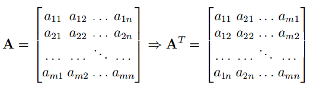

#  1. Lưu ý về kí hiệu
  
* Số vô hướng - chữ cái in nghiêng: .
* Vector - chữ thường in đậm: .
  * **Vector hàng**: .
  * **Vector cột**: .
  * **LƯU Ý**: Nếu không nói gì thêm, các vector dc mặc định là **vector cột**.
* Ma trận - chữ hoa in đậm: .
  * Ma trận được tạo thành từ các **vector cột** theo thứ tự **trái qua phải**: .
  * Ma trận đuôc tạo thành từ các **vector hàng** theo thứ tự **trên xuống dưới**: .
  * Phần tử nằm ở dòng  cột  của ma trận kí hiệu là .
  * **LƯU Ý**: Cho ma trận , nếu không nói gì thêm thì  được hiểu là **vector cột** thứ  của ma trận .
  
#  2. Chuyển vị và Hermitian
  
* Tên tiếng anh là **transpose**, kí hiệu là .
* Cho , ta nói  là chuyển vị của  nếu:
  

  
  
* Ví dụ:
  * Chuyển vị của vector  kí hiệu là .
    
  * Chuyển vị của ma trận  kí hiệu là .
    
  
* Ta có  thì . Nếu  thì  là **ma trận đối xứng** _(symmetric matrix)_.
  

  
* Trong trường hợp vector hay ma trận có phần tử là **số phức**, thì việc lấy chuyển vị sẽ kèm theo **lấy liên hợp phức** của phần tử đó. Quá trình này được gọi ngắn gọn là **chuyển vị liên hợp** _(conjugate transpose)_, kí hiệu là .
* Chuyển vị liên hợp của ma trận  là  _(còn được gọi là_  Hermitian _)_.
* Cho , ta nói  là chuyển vị liên hợp của  nếu:
  

  
  
  với  là liên hợp phức của .
  
* Ví dụ:
  * Chuyển vị liên hợp của vector  kí hiệu là .
    
  * Chuyển vị liên hợp của ma trận  kí hiệu là .
    
  
* Nếu  lần lượt là các ma trận thực và vector thực thì:
  

  
  
  
* Nếu chuyển vị liên hợp của một ma trận phức bằng với chính nó,  thì nói gọi ma trận đó là **Hermittian**.
  
#  3. Phép nhân hai ma trận
  
* Cho hai ma trận , thì tích của hai ma trận này kí hiệu là , khi đó phần tử tại dòng  cột  của ma trận kết quả được tính bởi:
  

  
  
  
* Tính chất:
  * Không có tính chất giao hoán.
    

  
  
  * Có tính chất kết hợp:
    

  
  
  * Có tính phân phối đối với phép cộng:
    

  
  
  * Chuyển vị của một rích bằng tích các chuyển vị theo thứ tự **ngược lại**:
    

  
  
  

  
* Bằng cách coi vector là một trượng hợp đặc biệt của ma trận, ta có tích vô hướng của hai vector _(inner product)_  được định nghĩa là:
  

  
  
  
* **LƯU Ý**: 
  

  
  
  khi và chỉ khi chúng là các số thực.
  
  

  
  
  
* Nếu tích vô hướng của **hai vector khác không** bằng không, thì hai vector đó **vuông góc với nhau**.
  

  
* Phép nhân của một ma trận  với một vector  là một vector :
  

  
  
  với  là vector hàng thứ  của ma trận .
  
* Ngoài ra còn có một phép nhân khác gọi là **Hadamard** _(còn được gọi là Element-wise)_ hay được sử dụng trong Machine Learning. Tích Hadamard của hai ma trận có **cùng kích thước**  được định nghĩa là:
  

  
  
  