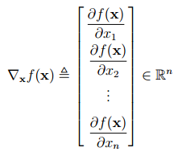
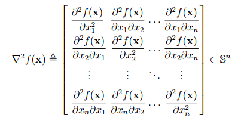
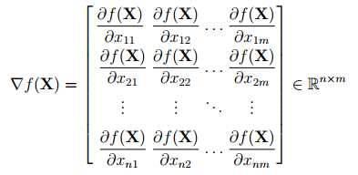
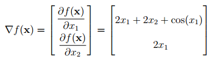
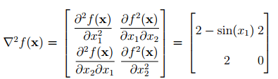
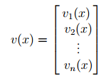
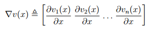
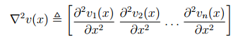
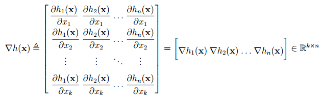

# 1. Đạo hàm của hàm trả về một số vô hướng
* **Đạo hàm bậc nhất** _(first-order gradient)_ hay viết gọn là **đạo hàm** _(gradient)_ của một hàm số $f(\mathbf{x}): \R^n \rightarrow \R$ theo $\mathbf{x}$ dc định nghĩa như sau:

  

    

  

  * Trong đó $\dfrac{\partial f(\mathbf{x})}{\partial x_i}$ là **đạo hàm riêng** _(partial derivative)_ của hàm số theo thành phần thứ $i$ của vector $\mathbf{x}$.
  * Đạo hàm này được tính bằng cách cho tất cả các biến ngoại trừ $x_i$ là **hằng số**.
  * Nếu như ko có thêm biến nào khác, thì $\nabla_\mathbf{x}f(\mathbf{x})$ thường dc viết gọn là $\nabla f(\mathbf{x})$
  * Đạo hàm của hàm số này là một vector có cùng chiều với vector đang dc lấy đạo hàm, tức nếu vector đag dc viết ở dạng cột thì đạo hàm cũng phải dc viết ở dạng cột.

* **Đạo hàm bậc hai** _(second-order gradient)_ của hàm số trên còn dc gọi là Hessian và dc định nghĩa như sau:
  * Với $\mathbb{S}^n \in \R^{n \times n}$ là tập các ma trận vuông đối xứng bậc $n$.
  
  

    

  

  * Hessian luôn là một ma trận đối xứng.
* Đạo hàm của một hàm số $f(\mathbf{X}): \R^{n \times m} \rightarrow \R$ theo ma trận $\mathbf{X}$ dc định nghĩa là:

  

    

  

  * Đạo hàm của hàm số $f: \R^{m \times n} \rightarrow \R$ là một ma trận trong $\R^{m \times n}, \forall m, n \in \mathbb{N}^*$.
  * Cụ thể để tính đạo hàm của một hàm $f: \R^{m \times n} \rightarrow \R$ ta sẽ tính đạo hàm riêng của hàm số đó theo từng thành phần của ma trận trong khi **toàn bộ các thành phần khác dc giả sử là hằng số**. Tiếp theo ta sẽ sắp xếp các đạo hàm tiêng tính dc theo đúng thứ tự trong ma trận.

* Ví dụ: Xét hàm số $f: \R^2 \rightarrow \R, f(\mathbf{x}) = x_1^2 + 2x_1 x_2 + \sin(x_1) + 2$.
  * Đạo hàm bậc nhất theo $\mathbf{x}$ của hàm số đó là:
  
    

      

    

  * Đạo hàm bậc hai theo $\mathbf{x}$ (hay Hessian) là:
    
    

      

    

    dễ dàng nhận thấy ma trận kết quả là một ma trận đối xứng.

# 2. Đạo hàm của hàm trả về một vector
* Những **hàm số trả về một vector**, hoặc gọn hơn là **hàm trả về vector** dc gọi là **vector-valued function**.
* Xét một hàm trả về vector với **đầu vào là một số thực** $v(x): \R \rightarrow \R^n$:
  

    

  

* Đạo hàm của hàm số này theo $x$ là một **vector hàng** như sau:
  

    

  

* **Đạo hàm bậc hai** của hàm số này có dạng:
  

    

  

* Ví dụ: Cho một vector $\mathbf{a} \in \R^n$ và một hàm số vector-valued $v(x) = x \mathbf{a}$, thì:
  * Đạo hàm bậc nhất:
    $$\nabla v(x) = \mathbf{a}^T$$
  
  * Đạo hàm bậc hai (Hessian):
    $$\nabla ^ 2 v(x) = 0 \in \R^{1 \times n}$$

* Xét một hàm trả về vector với đầu vào là một vector $h(\mathbf{x}): \R^k \rightarrow \R^n$, đạo hàm bậc nhất của nó là:
  

    

  

  * Nếu một hàm số $g: \R^m \rightarrow \R^n$, thì đạo hàm của nó là một ma trận thuộc $\R^{m \times n}$
  * Đạo hàm bậc hai của hàm số trên là một **mảng ba chiều**, chúng ta sẽ ko nghiên cứu đến ở đây.
* Trước khi đến phần tính đạo hàm của các hàm số thường gặp, cần biết đến hai tính chất quan trọng khá giống với đạo hàm của hàm một biến.

# 3. Tính chất quan trọng của đạo hàm
## 3.1. Quy tắc tích (Product rule)
* Giả sử biến đầu vào là một ma trận (giả sử rằng các hàm số có chiều phù hợp để các phép nhân ma trận thực hiện dc). Ta có:
  $$\nabla (f(\mathbf{X})^T g(\mathbf{X})) = (\nabla f(\mathbf{X})) g(\mathbf{X}) + (\nabla g(\mathbf{X})) f(\mathbf{X})$$
  * Biểu thức trên giống với biểu thức mà chúng ta đã quá quen thuộc:
    $$(f(x)g(x))' = f'(x)g(x) + g'(x)f(x)$$
  * Lưu ý rằng với tích của **vector và ma trận**, ta **ko sử dụng dc** tính chất giao hoán.

## 3.2. Quy tắc chuỗi (Chain rule)
* Khi có các hàm hợp thì:
  $$\nabla_{\mathbf{x}}g(f(\mathbf{X})) = (\nabla_\mathbf{x}f)^T (\nabla_f g)$$

* Quy tắc này cũng giống với quy tắc trong hàm một biến:
  $$(g(f(x)))' = f'(x)g'(x)$$

* Lưu ý khi làm việc với tích các ma trận thì kích thước của các ma trận trong tích phải phù hợp với nhau.

# 4. Đạo hàm của các hàm số thường gặp
## 4.1. $f(x) = \mathbf{a}^T\mathbf{x}$
* Giả sử $\mathbf{a, x} \in \R^n$, ta viết lại:
  $$f(\mathbf{x}) = \mathbf{a}^T\mathbf{x} = a_1 x_1 + a_2 x_2 + ... + a_n x_n$$

* Có thể thấy rằng: $\dfrac{\partial f(\mathbf{x})}{\partial x_i} = a_i, \forall i = 1, 2,...,n$
* Vậy:
  $$\nabla (\mathbf{a}^T \mathbf{x}) = [a_1 \space a_2 \space...\space a_n] = \mathbf{a}$$
* Ngoài ra vì $\mathbf{a}^T \mathbf{x} = \mathbf{x}^T\mathbf{a}$ nên:
  $$\nabla (\mathbf{x}^T \mathbf{a}) = \mathbf{a}$$